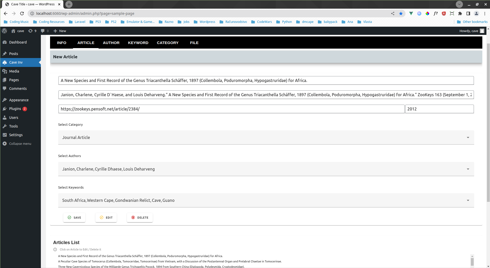

## Cave Invertebrates

#### Cave Invertebrates application that provides following features:
+ Live Search Articles, Authors & Keywords (admin panel)
+ Create, Edit, Delete Articles, Authors & Keywords (admin panel)
+ Upload Excell Articles Database Files (admin panel)
+ Display & Live Search Article (user panel)

Cave Invertebrates App Youtube Page - [Visit Website](https://www.youtube.com/@damirbubanovic6608)

## Built With

* [Vuetify CSS - 3.3.2](https://vuetifyjs.com/en/) - Css Library used
* [Vue.js - 3.3.4](https://vuejs.org/) - Frontend web framework used
* [MySQL - 8.0.33](https://www.mysql.com/) - SQL database used

## Author

* **Damir Bubanović** - *Initial work* - [Github](https://github.com/damir-bubanovic)

## Creator Self Promo Links

Damir Bubanović

- **[DamirBubanovic.com](https://damirbubanovic.com/)**
- **[GitHub](https://github.com/damir-bubanovic)**
- **[StackOwerflow](https://stackoverflow.com/users/11778242/damir-bubanovic)**
- **[Yahoo](damir.bubanovic@yahoo.com)**

## Acknowledgments

* Hat tip to anyone whose code was used including ChatGPT
* Inspiration
* etc
